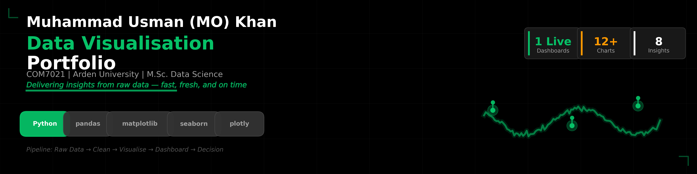

# Data Visualisation Portfolio — COM7021

> **M.Sc. Data Science | Arden University**
>
> End-to-end visual analytics project transforming raw retail data into interactive dashboards and business insights.

---

## Project Overview

This project demonstrates the complete data visualisation workflow — from exploratory data analysis to interactive dashboards. Using a retail/sales dataset, I created statistical charts, heatmaps, and a live HTML dashboard to uncover profit patterns across cities, products, and time periods.

**Key Deliverables:**
- **1 Interactive Dashboard** (HTML — opens in any browser)
- **12+ Static Visualisations** (PNG + HTML)
- **Business Insights** derived from visual patterns

---

## Dataset

- **Source:** Retail sales dataset (`Data Visualisation - COM7021 - [4566].xlsx`)
- **Features:** City, Product, Profit, Units Sold, Year, Month
- **Focus:** Profitability analysis across geographic and temporal dimensions

---

## Visualisation Gallery

| Type | File | Purpose |
|------|------|---------|
| **Pairplot** | `Figure_1_1_Pairplot.png` | Variable relationships |
| **Boxplot** | `Figure_1_2_Boxplot.png` | Outlier detection |
| **City-Product Profit** | `Figure_2_2_CityProductProfit.html` | Interactive profit breakdown |
| **Yearly Trend** | `Figure_2_3_YearlyTrend.html` | Time-series trend |
| **Financial Overview** | `Figure_2_4_FinancialOverview.png` | Summary metrics |
| **City-Year Heatmap** | `Figure_2_5_CityYearHeatmap.png` | Geographic-temporal patterns |
| **Units Sold** | `Figure_2_6_UnitsSold.png` | Volume analysis |
| **Monthly Heatmap** | `Figure_2_7_MonthlyHeatmap.png` | Seasonal patterns |
| **Monthly Trend** | `Figure_2_8_MonthlyTrend.png` | Monthly progression |
| **Profit Cities** | `profitcities.png` | City ranking |
| **Annual Profit** | `AnnualProfit_year.png` | Year-over-year comparison |
| **Dashboard** | `Figure_3_1_InteractiveDashboard.html` | **All-in-one interactive view** |

---

## Tech Stack

- **Language:** Python 3.x
- **Libraries:** pandas, matplotlib, seaborn, plotly
- **Output:** Static PNGs + Interactive HTML dashboards
- **Environment:** Jupyter Notebook

---

## How to Run

```bash
# 1. Clone the repository
git clone https://github.com/DATA-Meta/Data-Visualisation-COM7021.git
cd Data-Visualisation-COM7021

# 2. Install dependencies
pip install -r requirements.txt

# 3. Launch Jupyter and open the notebook
jupyter notebook
```

---

## Project Structure

```
├── README.md
├── requirements.txt
├── .gitignore
├── data/
│   └── Data Visualisation - COM7021 - [4566].xlsx
├── notebooks/
│   └── Data_Visualisation_project.ipynb
├── figures/
│   ├── Figure_1_1_Pairplot.png
│   ├── Figure_1_2_Boxplot.png
│   ├── Figure_2_2_CityProductProfit.html
│   ├── Figure_2_3_YearlyTrend.html
│   ├── Figure_2_4_FinancialOverview.png
│   ├── Figure_2_5_CityYearHeatmap.png
│   ├── Figure_2_6_UnitsSold.png
│   ├── Figure_2_7_MonthlyHeatmap.png
│   ├── Figure_2_8_MonthlyTrend.png
│   ├── profitcities.png
│   ├── AnnualProfit_year.png
│   └── dashboard.png
├── Dashboard/
│   └── Figure_3_1_InteractiveDashboard.html
└── reports/
    └── (academic report PDF)
```

---

## Author

**Student ID:** STU234608  
**Programme:** M.Sc. Data Science, Arden University  
**Module:** COM7021 — Data Visualisation

---

*This project was completed as part of academic coursework. Not intended for commercial deployment without further validation.*
